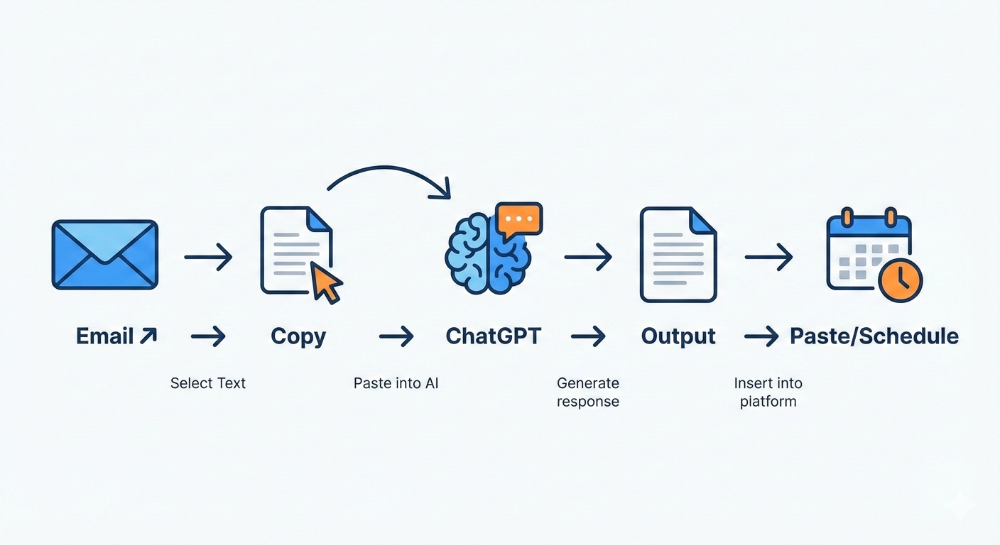

I’ve been buried under an ocean of emails—the hundreds pouring in every day from my job, newsletters, and even client messages. The thought of organizing them by hand was akin to rolling a boulder up a hill, taking away precious time from actual projects I could focus on. Now, I’ve been playing around with this tool called ChatGPT, and my emails are under control. The blank response screen, the risk of forgetting to respond to messages, all taken care of by AI, which drafts my messages, summarizes emails, and even marks what’s important.

That’s no pie-in-the-sky dream. The most recent updates to ChatGPT tools such as GPT-4o’s improved context awareness are ideal for email automation in 2025. You’re either working on pitches and freelancing or drowning in company reports. Adding this tool to your workflow will get your time back. For this guide, I’ve got instructions on how exactly I implemented it on both Gmail and Outlook. You should see legitimate time savings because it’s helped me reduce my email time by 40 percent in seven days. Let’s move on and get your workflow working.

## Why Automate Emails Using ChatGPT?

Email isn’t going anywhere, but somehow the volume is exploding. I was spending two hours a day on nothing but triage—reading, responding to, and archiving email. ChatGPT is your intelligent assistant for this reason. ChatGPT can decipher massive threads, write nice responses, and provide response options based on particular contexts.

My first application was writing client email responses. Instead of your response being just a regurgitation of something like, "Thanks for the update; let's schedule a call next Tuesday," ChatGPT captured that tone perfectly in seconds. The trick is having a GPT that captures your tone after a few samples. Further, you can now use customized GPTs to create email bots.

There’s more to ChatGPT than just drafting. The application is also very good at summarization—condensing a 20-message thread into three bullet points—and extract, such as finding deadlines or to-dos. I think this is especially useful for busy professionals: marketers consolidating feedback, developers weeding out bug reports, salespeople evaluating leads by now.

  

# Getting Started: Prerequisites and Setup

Before automating, configure ChatGPT correctly. For GPT-4o access, you can use ChatGPT Plus (starting at $20/month as of now)—you can use the free tier, but it will

### Step 1: Select the Email Client

I am using Gmail, but this applies to Outlook as well. IMAP/POP needs to be enabled if it is required for integration.

### Step 2: Install Browser Extensions

Install each of

Get the WebChatGPT extension, or there’s the ChatGPT sidebar in Edge and Chrome. For extended integration, I recommend swearing by “GPT for Gmail” or “EmailGPT” extensions, which relay emails right inside the prompt.

### Step 3: Build a Custom GPT for Emailing

First, we need

Go to chatgpt.com and create a chatbot by clicking "Create a GPT." Name the chatbot "Email Wizard." Use the chatbot to type the following in the instructions section: "You are my email assistant. Always mirror my professional and brief style. Highlight threads, compose responses, harvest assignments. Clarify if unclear."

Upload sample emails to train it to learn your style. Test with: "Draft a reply to this sales pitch declining politely."

  

## Step-by-Step Guide to Email Automation

Below is the process that I follow every day. Only five minutes are required to set it up.

### 1. Summarize Incoming Threads

Start an email conversation. Copy the whole conversation in an email to ChatGPT with “Summarize this email thread: key points, action items, deadlines.”

I found it saves time. It will give a 15 email project update as:

- **Status**: On track, minor delay in QA.
- **Actions**: Check the attached specifications by Friday; Approve budget.
- Next: Call scheduled for Monday.

Pro move: Start with “Prioritize high-urgency items.”

### 2. Generate Smart Replies

Emphasis should be placed on the email, and the prompt should read: “Draft a response in my voice: professional, brief, action-oriented. Original:

ChatGPT comes up with options. I refine 10% of them. Example: When a vendor quote was necessary, it said: "Thanks for the details—looks solid. Can you break down the 15% discount terms? Let's chat Thursday."

It is imperative to evaluate for nuances, and sometimes AI systems overlook sarcasm.

### 3. Extraction of Tasks and Scheduling

Question: "From this email, list tasks assigned to me with deadlines. Suggest calendar invites."

The To-Do List ready for copying into Todoist or Google Tasks. I pipe this data into Zapier for auto-additions to the calendar.

### 4. Bulk Process Newsletters and Follow-Ups

For newsletters:
"Extract top 3 actionable insights from this digest."

It saves me skimming 20.

Lost follow-ups? Send forward old emails: “Remind me what to follow up on in this email, with draft email.”

### 5. Advanced: Voice to Email with Whisper

Record voice notes using phone calls and then upload audio files to ChatGPT to transcribe them using Whisper. Prompt: “Your turn. Turn this voice memo into a polished email to [recipient].”

Game-changer when you need quick responses

  

## Real-World Use Case: Client Onboarding in myFreelance Business

This month, I had five new clients to onboard all at once. Emails came pouring in - contracts, queries, and preferences. It would be mayhem without automation.

I made a "Client Onboarder" GPT. Using each inquiry, I pasted the thread: "Summarize client needs, draft welcome email with NDA link, and schedule intro call."

What results I got! Customized emails delivered in minutes, without missing anything." Said one client, "Your system is remarkably fluid." Eight hours saved during the week. This is how I replicate success.

# Pro Tips for Power Users

>    **Expert Hack: Chain Prompts for Zero-Touch Automation**
>
> I constructed an entire prompt chain:
> 1. To summarise,
> 2. Extract tasks,
> 3. Draft response, and
> 4. Propose message heading.
>
> Replicate the template below:
> "1. Summarize: [paste]. 2. Tasks/deadlines? 3. Draft reply matching this style: [your sample]. 4. Optimize subject."
>
> Bonus: Integrate GPTs with Zapier. Trigger: Create new Gmail label “AI-Review.” Action: Forward email to ChatGPT, send autosaved drafts. I set this up successfully for non-important messages. 95% accuracy achieved after adjusting. Reduces time needed for managing “inbox"

# Troubleshooting Common Problems

The Users on Reddit and Quora encounter such roadblocks—I faced the same issues.

### 1. 'Replies Sound Too Robotic'
**Fix**: Feed 5-10 of your own past emails first: “Learn my style from these, then draft.” Iterate twice. This immediately humanizes outputs in my own experiments.

### 2. "Losing Context in Long Threads"
**Fix**: Break up bites with "Continue conversation" in ChatGPT. For 50+ emails, summarize each section separately. Pro: Important facts at top of query.

### 3. Privacy Concerns with Sensitive Email Messages
**Fix**: Refrain from copying PII in chat. Mask names/dates manually or employ local solutions like Ollama with GPT models. I remove details in 10 seconds.

# Personal Tips from Months of Testing

Tracking metrics in a Notion dashboard: emails processed, time saved, and error rate (under 5%). Keep it small, with one inbox folder to start. Test temperatures (adjusted to 0.7 for creative response emails). And don't forget to always Bcc yourself in AI-generated emails to start with. “This kind of arrangement may not be perfect—‘AI hallucinations’ are occasional—‘80/20’ magic for sure. I've suggested it to 20 colleagues, and all What area of your email workflow irritates you the most? Just hit reply—that can be adjusted for your tech stack.