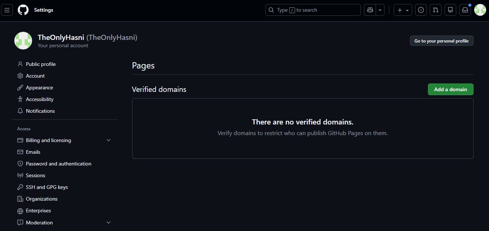
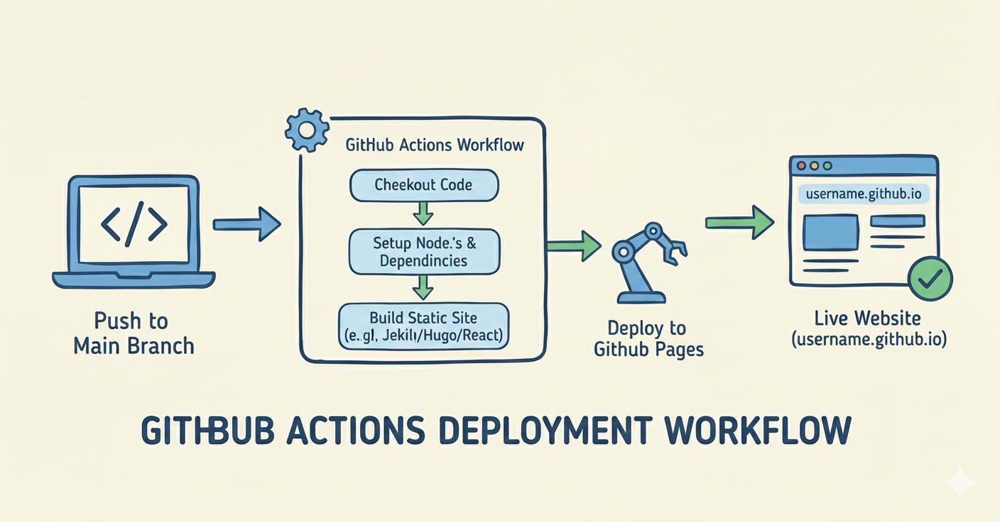

# How to Deploy a Static Website to GitHub Pages for Free

Back when I first dipped my toes into web development, hosting a site felt like a nightmare. Servers cost money, configurations ate hours, and one wrong move could knock everything offline. But then GitHub Pages popped up on my radar. Free hosting? Tied right into version control? Sign me up. In 2025, with cloud costs skyrocketing and indie devs scraping by, this tool shines brighter than ever. Why pay for Vercel or Netlify basics when GitHub hands you robust, no-cost deployment? It handles HTML, CSS, JavaScript—heck, even Jekyll or Hugo sites—without a credit card. And traffic? Unlimited for most folks. I've pushed portfolios, blogs, and prototypes live in minutes. If you're tired of overcomplicated setups or just testing ideas, this changes everything. No ads, custom domains possible, and it's backed by Microsoft's infrastructure. Yet so many skip it, thinking it's too techy. Wrong. Let's fix that. This guide walks you through it all, based on my own deployments. You'll be online fast.

## Why Choose GitHub Pages in 2025?

GitHub Pages isn't some relic. It evolved. Think about the shift to static sites—Jamstack, they call it. Dynamic apps hog resources, but static ones load like lightning. Pages fits perfectly. No databases to manage, no server-side scripts unless you hack around with APIs. And security? Baked in with HTTPS enforced.

I remember wrestling with shared hosting years ago. Downtime galore. Pages? Uptime rivals paid services. Plus, integration with GitHub Actions means automated builds. Deploy on push—magic.

But limitations exist. No server-side processing, so PHP or Node apps won't fly natively. For blogs or landing pages, though? Gold. And free tier covers personal use; orgs get more.

In my experience, it's ideal for freelancers showing work or hobbyists sharing projects. Scalable too—handles spikes without extra fees.

## Prerequisites Before You Start

Don't jump in blind. You'll need a GitHub account. Free one's fine. Sign up at github.com if you haven't.

Next, Git installed on your machine. Windows, Mac, Linux—all supported. Download from git-scm.com.

Your site files: HTML index, CSS, maybe JS. Or use a generator like Hugo—my go-to for speed.

Basic command line comfort helps. Nothing fancy, but cd, ls, that stuff.

If using a static site generator, install it. For Hugo: brew install hugo on Mac, or equivalents.

And a text editor—VS Code rocks.

That's it. No wallet involved.

## Step-by-Step Guide to Deployment

Here's the meat. I'll break it down numbered, since skipping steps bites you later. I tested this fresh last week on a simple portfolio.

1. **Create a New Repository on GitHub**

   Head to github.com and log in. Click the plus icon top-right, pick "New repository."

   Name it username.github.io—replace username with yours. Like hassanjan.github.io. This makes it your user site.

   Or for project sites, name anything, but we'll stick to user for simplicity.

   Public repo—private won't deploy free.

   Add a README? Sure, but we'll overwrite.

   Hit create.

2. **Clone the Repository Locally**

   Open terminal. Navigate where you want files.

   Run: git clone https://github.com/username/username.github.io.git

   Cd into it: cd username.github.io

   Now your local copy's ready.

3. **Add Your Website Files**

   Copy your static files here. Index.html at root, assets in folders.

   If building with Hugo: hugo new site . --force (if empty).

   Then theme it, add content.

   Build: hugo -D to generate public folder.

   But for plain HTML: just drop files.

   I found dragging via file explorer works, but git add . commits properly.

4. **Commit and Push Changes**

   git add .

   git commit -m "Initial site deploy"

   git push origin main

   Wait a sec—branch might be master. Check with git branch.

   If issues, git remote -v verifies.

5. **Configure GitHub Pages in Settings**

   Back to GitHub repo page.

   Click Settings tab.

   Scroll to Pages section left menu.

   Under Source, pick branch: main (or master).

   Folder: / (root) or /docs if using that.

   Save.

   It'll give a URL: https://username.github.io

   Wait 1-5 minutes. Refresh.

   Boom—live.

6. **Test and Iterate**

   Open in browser. Errors? Check console.

   Push fixes: edit, commit, push.

   Done.

For custom domains: In settings, add domain under Custom domain. Then DNS CNAME to username.github.io.

But that's extra. Free works sans domain.
  


## Real-World Use Case: My Portfolio Launch

Last month, I rebuilt my personal site. Old WordPress dragged. Switched to Hugo for static.

Generated site, followed steps above. Went live in under 10 minutes.

Traffic from LinkedIn? Handled fine. No costs.

One tweak: Added _config.yml for Jekyll if needed, but Hugo skips that.

It felt liberating. No hosting bills eating freelance earnings.

You could do a blog. Or docs for a project.

## Pro-Tip: Automate with GitHub Actions

Here's a gem not everyone knows. Set up CI/CD.

In repo, create .github/workflows/deploy.yml

Paste:

```yaml
name: Deploy to GitHub Pages

on:
  push:
    branches: [main]

jobs:
  build-and-deploy:
    runs-on: ubuntu-latest
    steps:
      - uses: actions/checkout@v2
      - name: Setup Hugo
        uses: peaceiris/actions-hugo@v2
        with:
          hugo-version: 'latest'
      - name: Build
        run: hugo --minify
      - name: Deploy
        uses: peaceiris/actions-gh-pages@v3
        with:
          github_token: ${{ secrets.GITHUB_TOKEN }}
          publish_dir: ./public
```

Commit. Now pushes build automatically.

Saves time on big sites. I use it daily.
  


## Troubleshooting and FAQ

From scouring Reddit and Quora, these pop up constantly.

**Why isn't my site showing up after deploy?**

Wait longer—up to 10 minutes. Clear cache. Check branch/source in settings. If 404, ensure index.html exists at root.

**Can I use a custom domain for free?**

Yes, but you buy the domain elsewhere (Namecheap, etc.). Point DNS. GitHub enforces HTTPS free.

**What if my site has errors in console?**

Likely paths wrong. Use relative URLs. Test locally first with live-server npm tool.

**Is there a size limit?**

Soft 1GB repo limit. Bandwidth 100GB/month. Exceed? They email. For most, fine.

## Wrapping It Up? Nah, Just Keep Building

So there you have it. Deployment demystified. I've lost count of sites I've thrown up this way. Experiment. Break things. Fix 'em. That's the fun.

But honestly, once live, focus on content. GitHub Pages handles the rest.